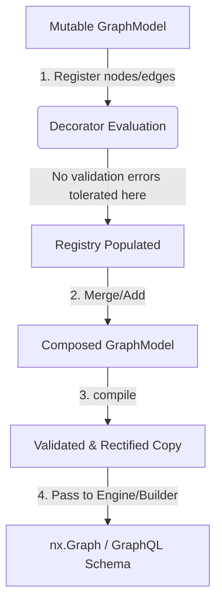

# GEP-032: GraphModel Compilation and Validation Lifecycle

| Field       | Value                                           |
|:------------|:------------------------------------------------|
| **GEP**     | 32                                              |
| **Title**   | GraphModel Compilation and Validation Lifecycle |
| **Author**  | Eran Rivlis                                     |
| **Status**  | Draft                                           |
| **Type**    | Standards Track                                 |
| **Created** | 2026-06-22                                      |
| **Updated** | 2026-06-22                                      |

## Abstract

This proposal introduces a formal compilation and validation lifecycle for `GraphModel` instances. It decouples the **Definition/Registration phase** (when decorators like `@model.node` are evaluated) from the **Compilation/Validation phase** (when the model is finalized and validated). By shifting verification and default rectification (`rectify()`) to this compilation step, we solve import order constraints, mutable side-effects, and enable robust modular model composition.

## Motivation

Currently, `GraphModel` performs validation and mutation at two suboptimal moments:
1. **Eager Registration Validation (Decorator Time):** When `@model.node` is evaluated, it eagerly runs `_validate_node_dependency_registration`. This requires all target dependency node types to already be registered, imposing a strict topological import/decoration order.
2. **In-place Model Mutation (Build Time):** When `Builder.build()` is invoked, the builder calls `self.model.rectify()` in-place. If multiple builders run concurrently on the same shared model (e.g., in a multi-threaded web server), they can cause race conditions or duplicate registration mutations.
3. **Impeded Composition:** If two partial models (each containing reference dependencies to types defined in the other) are imported, they cannot be decorated without failing eagerly—even though their composition (`ModelA + ModelB`) would be fully valid and complete.

## Rationale

The **Council Framework** pillars guide this design:
* **Symmetry (Noether):** Decorators should strictly represent configuration/metadata declaration. Execution and structural checks should belong to compilation/build stages.
* **Safety (The Golem):** By performing compilation on an immutable copy/clone of the model, we eliminate side-effects on shared module-level objects and ensure thread safety.
* **Harmony (The Steward):** This model maintains 100% backwards compatibility. The user-facing API remains unchanged.

---

## Technical Specification

We propose introducing a **Compilation Phase** that transitions a mutable `GraphModel` (acting as a definition registry) into an immutable validated state.



### 1. The Compilation Phase
We add a `compile()` method to `GraphModel`:

```python
class GraphModel:
    # ...
    
    def compile(self) -> 'GraphModel':
        """Compiles and validates a copy of the graph model.
        
        Returns:
            A rectified, validated, and frozen GraphModel clone.
            
        Raises:
            GraphModelError: If the model configuration has unresolved dependencies.
        """
        # 1. Deep clone the registry maps
        compiled_model = GraphModel(name=self.name)
        
        # Clone internal node/edge registries
        for k, v in self._node_models.items():
            compiled_model._node_models[k] = list(v)
        for k, v in self._node_children.items():
            compiled_model._node_children[k] = list(v)
        for k, v in self._edge_generators.items():
            compiled_model._edge_generators[k] = list(v)
            
        # 2. Rectify the cloned model (in-place mutation on the clone only)
        # (This moves rectify out of the builder and onto the model's compilation loop)
        compiled_model.rectify()
        
        # 3. Perform structural validation
        compiled_model._validate_structural_dependencies()
        
        return compiled_model
```

### 2. Deferred Structural Validation
Instead of running `_validate_node_dependency_registration` at decorator time, it is refactored into a full model check:

```python
def _validate_structural_dependencies(self):
    """Verifies that all registered node dependencies exist within the compiled model.
    
    Raises:
        GraphModelError: If any node model references a parent/dependency type 
                        not present in the compiled model's nodes.
    """
    registered_types = self.node_types
    for node_models in self._node_models.values():
        for node_model in node_models:
            for param_name, dep_type in node_model.dependencies.items():
                if dep_type is not UniverseNode and dep_type not in registered_types:
                    raise GraphModelError(
                        f"Unresolved dependency: Node type '{node_model.type}' requires "
                        f"'{dep_type}' (for parameter '{param_name}'), which is not registered."
                    )
```

---

## Relations & Synergies with Existing GEPs

This proposal serves as the structural glue between several critical enhancement proposals:

### 1. GEP-010 (Explicit Dependency Injection)
* **Synergy:** GEP-010 introduced type-hinted dependencies. By deferring validation to the compilation phase, circular dependencies (e.g., NodeA depending on NodeB, and NodeB depending on NodeA) are fully supported. Decorators do not fail on import; validation only asserts that the cycle is completely closed once compiled.

### 2. GEP-012 (Robust Model Composition)
* **Synergy:** Under GEP-012, `ModelA + ModelB` merges registries. Because individual models are not eagerly validated, we can compose partial models that rely on each other's types. The final validation is run once on the combined registry returned by `(ModelA + ModelB).compile()`.

### 3. GEP-017 (Decoupled Server Architecture)
* **Cross-Cutting Concerns:** In a server environment, the same `GraphModel` might be built concurrently for different requests. Working on a compiled clone prevents concurrent execution from mutating shared definitions in-place, preventing state leakage and race conditions.

### 4. GEP-024 (The Graph Engine)
* **Synergy:** The `GraphEngine` execution loop can require a pre-compiled model (`GraphEngine(model.compile())`). This guarantees that when the engine runs, the model is structurally sound, allowing the hot loop to bypass validation checks entirely and maximize execution throughput.

---

## Backwards Compatibility

* **Decorator Syntax:** Remains identical. All `@model.node` and `@model.edge` decorators function exactly as before.
* **Auto-Compilation:** To ensure existing builder code (`NetworkxBuilder(model).build()`) does not break, the `Builder` base class will automatically call `model.compile()` during initialization or at the start of `build()`.

---

## Reference Implementation

* **Source File:** [modeling.py](file:///C:/dev/erivlis/graphinate/src/graphinate/modeling.py)
* **Builder Integration:** [builder.py](file:///C:/dev/erivlis/graphinate/src/graphinate/builders/builder.py)

---

## Change Log

* 2026-06-22: Initial Draft outlining the compilation phases, late validation, and synergies with GEP-010, GEP-012, and GEP-024.
