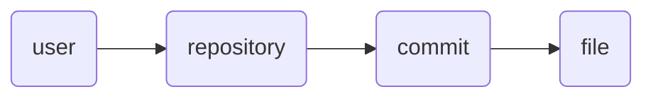

# Modeling Concepts

## Dependency Injection and Parameter Naming

When defining node generators using `@model.node`, you can request context from parent nodes by adding arguments to your
generator function.

**Strict Naming Convention:**
To receive the ID of a parent node, your argument name must follow this pattern: `{node_type}_id`.

For example, if you have a node type `user`, a child node generator can request `user_id`.

```python
@model.node(parent_type='user')
def get_posts(user_id):
    # user_id is automatically injected
    ...
```

**Note:** Arbitrary arguments are not currently supported. All arguments must match a registered node type followed by
`_id`.

## Example

See the following examples for practical usage of this
pattern: [GitHub Repositories](../examples/github.md#repositories)
It demonstrates a deep hierarchy using dependency injection.


