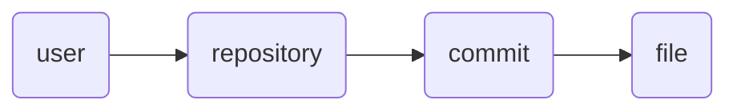

# Modeling Concepts

## Dependency Injection and Parameter Naming

When defining node generators using `@model.node`, you can request parent context or pass custom configurations to your generator functions. Graphinate supports two styles of dependency injection:

### 1. Explicit Dependency Injection (Preferred)

You can explicitly declare a parent dependency using type annotations with `typing.Annotated` and the `graphinate.ParentId` marker. This decouples the parameter name from the target node type and improves type-safety:

```python
from typing import Annotated
from graphinate import ParentId

@model.node(parent_type='user')
def get_posts(uid: Annotated[str, ParentId('user')], limit: int = 10):
    # 'uid' is resolved from parent 'user' key
    # 'limit' is an arbitrary configuration argument passed to the builder
    ...
```

#### Using Enums for Node Types

To prevent typos and leverage editor autocomplete, you can pass standard `enum.Enum` or `enum.StrEnum` members to the `@model.node` decorator and `ParentId`. Graphinate automatically resolves them to their `.value` strings at runtime:

```python
from enum import Enum
from typing import Annotated
from graphinate import ParentId

class NodeTypes(Enum):
    USER = 'user'
    POST = 'post'

@model.node(type_=NodeTypes.POST, parent_type=NodeTypes.USER)
def get_posts(uid: Annotated[str, ParentId(NodeTypes.USER)]):
    # uid is resolved using the string value of NodeTypes.USER ('user')
    ...
```


### 2. Implicit Fallback (Legacy)

For backward compatibility, any parameter that matches the `{node_type}_id` naming convention (lowercase and ending with `_id`) will automatically resolve to that parent's ID if no explicit `ParentId` annotation is present:

```python
@model.node(parent_type='user')
def get_posts(user_id):
    # user_id is automatically injected
    ...
```

### 3. Arbitrary Configuration Parameters

Validation has been relaxed to permit arbitrary parameters (such as `limit`, `since_date`, etc.). These parameters are ignored by the dependency injection system and will be passed directly from the builder's runtime arguments (e.g., `builder.build(limit=5)`).


## Example

See the following examples for practical usage of this
pattern: [GitHub Repositories](../examples/github.md#repositories)
It demonstrates a deep hierarchy using dependency injection.


