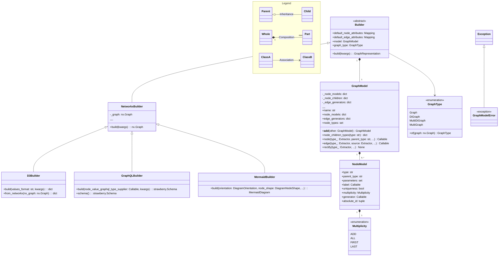

```mermaid
classDiagram
    namespace Legend {
        class Parent
        class Child
        class Whole
        class Part
        class ClassA
        class ClassB
    }
    Parent <|-- Child : Inheritance
    Whole "1" *-- "many" Part : Composition
    ClassA --> ClassB : Association

    class Builder {
        <<abstract>>
        +default_node_attributes: Mapping
        +default_edge_attributes: Mapping
        +model: GraphModel
        +graph_type: GraphType
        +build(kwargs): GraphRepresentation
    }

    class NetworkxBuilder {
        -_graph: nx.Graph
        __
        +build(kwargs): nx.Graph
    }

    class D3Builder {
        +build(values_format: str, kwargs): dict
        +from_networkx(nx_graph: nx.Graph): dict
    }

    class GraphQLBuilder {
        +build(node_value_graphql_type_supplier: Callable, kwargs): strawberry.Schema
        +schema(): strawberry.Schema
    }

    class MermaidBuilder {
        +build(orientation: DiagramOrientation, node_shape: DiagramNodeShape, ...): MermaidDiagram
    }

    class GraphModel {
        -_node_models: dict
        -_node_children: dict
        -_edge_generators: dict
        __
        +name: str
        +node_models: dict
        +edge_generators: dict
        +node_types: set
        +__add__(other: GraphModel) GraphModel
        +node_children_types(type: str) dict
        +node(type_: Extractor, parent_type: str, ...) Callable
        +edge(type_: Extractor, source: Extractor, ...) Callable
        +rectify(type_: Extractor, ...) None
    }

    class NodeModel {
        +type: str
        +parent_type: str
        +parameters: set
        +label: Callable
        +uniqueness: bool
        +multiplicity: Multiplicity
        +generator: Callable
        +absolute_id: tuple
    }

    class Multiplicity {
        <<enumeration>>
        ADD
        ALL
        FIRST
        LAST
    }

    class GraphType {
        <<enumeration>>
        Graph
        DiGraph
        MultiDiGraph
        MultiGraph
        +of(graph: nx.Graph) GraphType
    }

    class GraphModelError {
        <<exception>>
    }

    Builder <|-- NetworkxBuilder
    NetworkxBuilder <|-- D3Builder
    NetworkxBuilder <|-- GraphQLBuilder
    NetworkxBuilder <|-- MermaidBuilder

    Builder "1" *-- "1" GraphModel
    Builder --> GraphType
    GraphModel "1" *-- "0..*" NodeModel
    NodeModel "1" *-- "1" Multiplicity
    Exception <|-- GraphModelError
```
