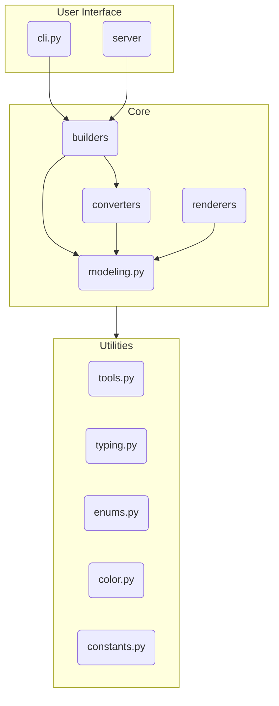

```mermaid
graph TD
    subgraph User Interface
        CLI(cli.py)
        Server(server)
    end

    subgraph Core
        Modeling(modeling.py)
        Builders(builders)
        Converters(converters)
        Renderers(renderers)
    end

    subgraph Utilities
        Tools(tools.py)
        Typing(typing.py)
        Enums(enums.py)
        Color(color.py)
        Constants(constants.py)
    end

    CLI --> Builders
    Server --> Builders
    Builders --> Modeling
    Builders --> Converters
    Converters --> Modeling
    Renderers --> Modeling

    Core --> Utilities
```
