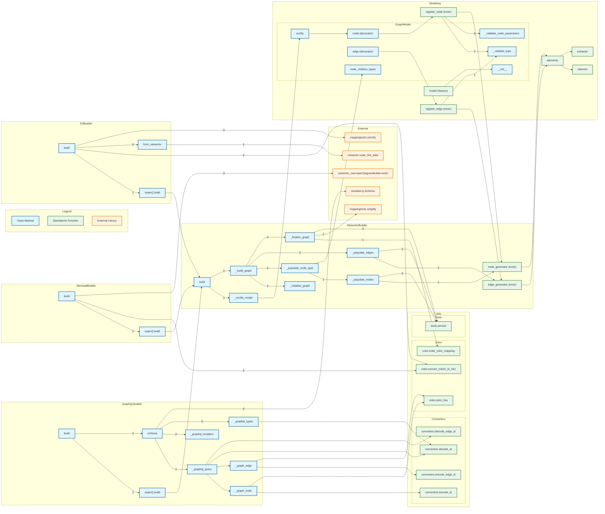

```mermaid
graph LR
    %% Define styles
    classDef method fill:#e1f5fe,stroke:#01579b,stroke-width:2px;
    classDef function fill:#e8f5e9,stroke:#2e7d32,stroke-width:2px;
    classDef external fill:#fff3e0,stroke:#ef6c00,stroke-width:2px;

    subgraph Legend
        L_Method["Class Method"]:::method
        L_Function["Standalone Function"]:::function
        L_External["External Library"]:::external
    end

    subgraph Utils
        direction TB
        subgraph Color
            color.convert_colors_to_hex
            color.color_hex
            color.node_color_mapping
        end

        subgraph Converters
            converters.decode_id
            converters.decode_edge_id
            converters.encode_id
            converters.encode_edge_id
        end

        subgraph Tools
            tools.utcnow
        end
    end

    subgraph External
        direction TB
        mappingtools.strictify
        mappingtools.simplify
        networkx.node_link_data
        strawberry.Schema
        networkx_mermaid.DiagramBuilder.build
    end

    subgraph D3Builder
        direction TB
        D3Builder_build["build"] -- 1 --> D3Builder_super_build["super().build"]
        D3Builder_build -- 2 --> color.convert_colors_to_hex
        D3Builder_build -- 3 --> D3Builder_from_networkx["from_networkx"]
        D3Builder_build -- 4 --> mappingtools.strictify
        D3Builder_from_networkx -- 1 --> networkx.node_link_data
    end

    subgraph GraphQLBuilder
        direction TB
        GraphQLBuilder_build["build"] -- 1 --> GraphQLBuilder_super_build["super().build"]
        GraphQLBuilder_build -- 2 --> GraphQLBuilder_schema["schema"]
        GraphQLBuilder_schema -- 1 --> GraphQLBuilder_graphql_query["_graphql_query"]
        GraphQLBuilder_schema -- 2 --> GraphQLBuilder_graphql_mutation["_graphql_mutation"]
        GraphQLBuilder_schema -- 3 --> GraphQLBuilder_graphql_types["_graphql_types"]
        GraphQLBuilder_schema -- 4 --> strawberry.Schema
        
        GraphQLBuilder_graphql_query --> GraphQLBuilder_graph_node["_graph_node"]
        GraphQLBuilder_graphql_query --> GraphQLBuilder_graph_edge["_graph_edge"]
        GraphQLBuilder_graphql_query --> converters.decode_id
        GraphQLBuilder_graphql_query --> converters.decode_edge_id
        
        GraphQLBuilder_graphql_types --> converters.decode_id
        
        GraphQLBuilder_graph_node --> converters.encode_id
        GraphQLBuilder_graph_node --> color.color_hex
        
        GraphQLBuilder_graph_edge --> converters.encode_edge_id
        GraphQLBuilder_graph_edge --> color.color_hex
    end

    subgraph MermaidBuilder
        direction TB
        MermaidBuilder_build["build"] -- 1 --> MermaidBuilder_super_build["super().build"]
        MermaidBuilder_build -- 2 --> color.convert_colors_to_hex
        MermaidBuilder_build -- 3 --> networkx_mermaid.DiagramBuilder.build
    end

    subgraph NetworkxBuilder
        direction TB
        NetworkxBuilder_build["build"] -- 1 --> NetworkxBuilder_rectify_model["_rectify_model"]
        NetworkxBuilder_build -- 2 --> NetworkxBuilder_build_graph["_build_graph"]
        NetworkxBuilder_build_graph -- 1 --> NetworkxBuilder_initialize_graph["_initialize_graph"]
        NetworkxBuilder_build_graph -- 2 --> NetworkxBuilder_populate_node_type["_populate_node_type"]
        NetworkxBuilder_populate_node_type -- 1 --> NetworkxBuilder_populate_nodes["_populate_nodes"]
        NetworkxBuilder_build_graph -- 3 --> NetworkxBuilder_populate_edges["_populate_edges"]
        NetworkxBuilder_build_graph -- 4 --> NetworkxBuilder_finalize_graph["_finalize_graph"]
        
        NetworkxBuilder_populate_nodes -- 1 --> M_node_generator
        NetworkxBuilder_populate_nodes -- 2 --> tools.utcnow
        NetworkxBuilder_populate_edges -- 1 --> M_edge_generator
        NetworkxBuilder_populate_edges -- 2 --> tools.utcnow
        NetworkxBuilder_finalize_graph -- 1 --> color.node_color_mapping
        NetworkxBuilder_finalize_graph -- 2 --> mappingtools.simplify
        NetworkxBuilder_finalize_graph -- 3 --> tools.utcnow
    end

    subgraph Modeling
        direction TB
        subgraph GraphModel
            direction TB
            GM_init["__init__"]
            GM_node["node (decorator)"]
            GM_edge["edge (decorator)"]
            GM_rectify["rectify"]
            GM_validate_type["_validate_type"]
            GM_validate_node_parameters["_validate_node_parameters"]
            GM_node_children_types["node_children_types"]
        end

        GM_node --> register_node["register_node (inner)"]
        register_node -- 1 --> GM_validate_type
        register_node -- 2 --> GM_validate_node_parameters
        register_node --> M_node_generator["node_generator (inner)"]
        
        GM_edge --> register_edge["register_edge (inner)"]
        register_edge -- 1 --> GM_validate_type
        register_edge --> M_edge_generator["edge_generator (inner)"]

        M_node_generator --> M_elements["elements"]
        M_edge_generator --> M_elements
        M_elements --> element
        M_elements --> extractor

        GM_rectify --> GM_node

        model["model (factory)"] --> GM_init
    end

    D3Builder_super_build --> NetworkxBuilder_build
    GraphQLBuilder_super_build --> NetworkxBuilder_build
    MermaidBuilder_super_build --> NetworkxBuilder_build

    NetworkxBuilder_rectify_model --> GM_rectify
    NetworkxBuilder_populate_node_type --> GM_node_children_types

    %% Apply styles
    class D3Builder_build,D3Builder_super_build,D3Builder_from_networkx method;
    class GraphQLBuilder_build,GraphQLBuilder_super_build,GraphQLBuilder_schema,GraphQLBuilder_graphql_query,GraphQLBuilder_graphql_mutation,GraphQLBuilder_graphql_types,GraphQLBuilder_graph_node,GraphQLBuilder_graph_edge method;
    class MermaidBuilder_build,MermaidBuilder_super_build method;
    class NetworkxBuilder_build,NetworkxBuilder_rectify_model,NetworkxBuilder_build_graph,NetworkxBuilder_initialize_graph,NetworkxBuilder_populate_node_type,NetworkxBuilder_populate_nodes,NetworkxBuilder_populate_edges,NetworkxBuilder_finalize_graph method;
    class GM_init,GM_node,GM_edge,GM_rectify,GM_validate_type,GM_validate_node_parameters,GM_node_children_types method;
    
    class color.convert_colors_to_hex,converters.decode_id,converters.decode_edge_id,converters.encode_id,converters.encode_edge_id,color.color_hex function;
    class tools.utcnow,color.node_color_mapping function;
    class register_node,M_node_generator,register_edge,M_edge_generator,M_elements,element,extractor,model function;

    class mappingtools.strictify,networkx.node_link_data,mappingtools.simplify,strawberry.Schema,networkx_mermaid.DiagramBuilder.build external;
```
